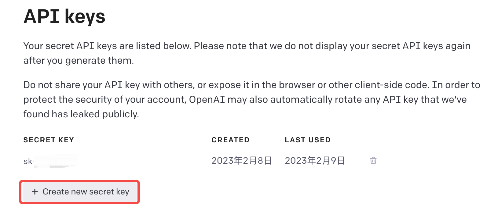
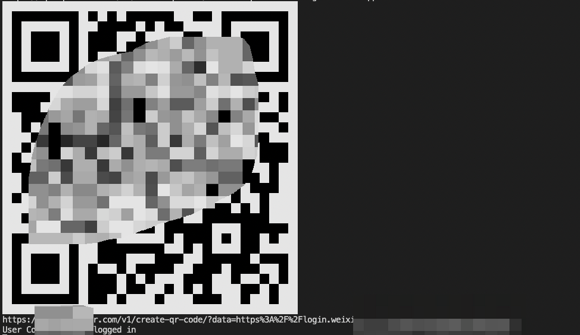
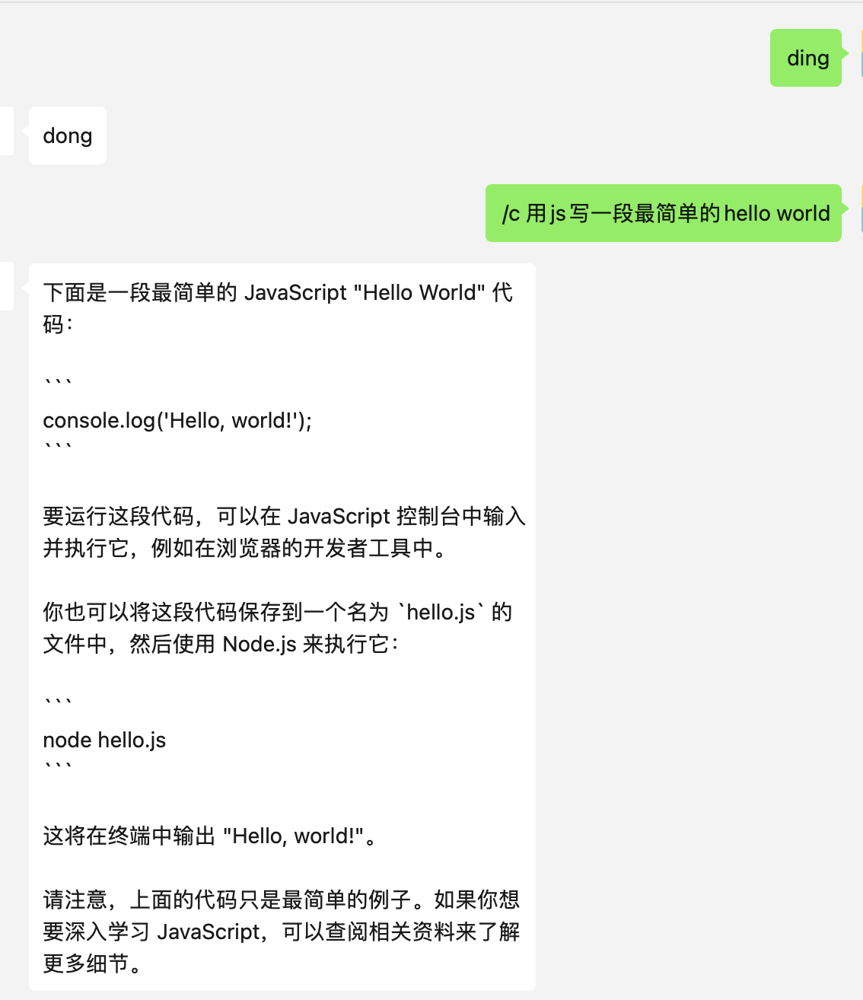

# 2023年2月9日更新

- 使用API调用，无需科学上网
- 使用UOS协议（包括本项目）登录微信有封号风险，请谨慎使用

# 2022年12月14日更新

- ~~openai加强了登录检测，基于sessionToken方式需要增加cf_clearance，但是有效期只有2个小时。~~
- ~~基于账号密码登录的方式需要有境外服务器或者能够代理到境外。~~
- 最近有很多使用UOS协议（包括本项目）登录微信的号被封。


# 基于wechaty创建一个自己的ChatGPT机器人

## 流程

### 注册ChatGPT账号

- 注册地址: <https://chat.openai.com/chat>
- 国内注册教程: <https://juejin.cn/post/7173447848292253704>

### 登录ChatGPT获取OPENAI_API_KEY

- 打开网页: <https://platform.openai.com/account/api-keys>
- 创建密钥



### 安装机器人

#### Docker安装

```bash
export OPENAI_API_KEY=上一步中创建的密钥 

docker run -e OPENAI_API_KEY="$(echo $OPENAI_API_KEY)" --rm -it registry.cn-hangzhou.aliyuncs.com/sunshanpeng/wechaty-chatgpt:0.1.0
```

#### 源码安装

```bash
git clone https://github.com/sunshanpeng/wechaty-chatgpt.git
cd wechaty-chatgpt
```

```bash
export OPENAI_API_KEY=上一步中创建的密钥 
# install dependencies
npm i
# run(需要node 18)
npm run chatgpt
```

### 使用机器人

- 扫码登录



- 测试ding-dong
- /c 使用chatgpt



## 感谢

- <https://github.com/wechaty/wechaty/>
- <https://github.com/transitive-bullshit/chatgpt-api>
